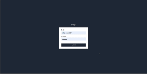

# CRM Customers Client

This is the client side of the CRM Customers application. It is a Next.js application that uses Apollo Client to connect to the GraphQL API.

## Scripts

Here are the scripts you can run:

- `dev`: Runs the app in the development mode.
- `build`: Builds the app for production.
- `start`: Runs the compiled app in production mode.
- `lint`: Lints the codebase.

## Dependencies

This project uses the following dependencies:

- @apollo/client
- formik
- graphql
- next
- react
- react-dom
- react-select
- react-spinners
- recharts
- sweetalert2
- yup

## Dev Dependencies

This project uses the following development dependencies:

- autoprefixer
- eslint
- eslint-config-next
- postcss
- tailwindcss

